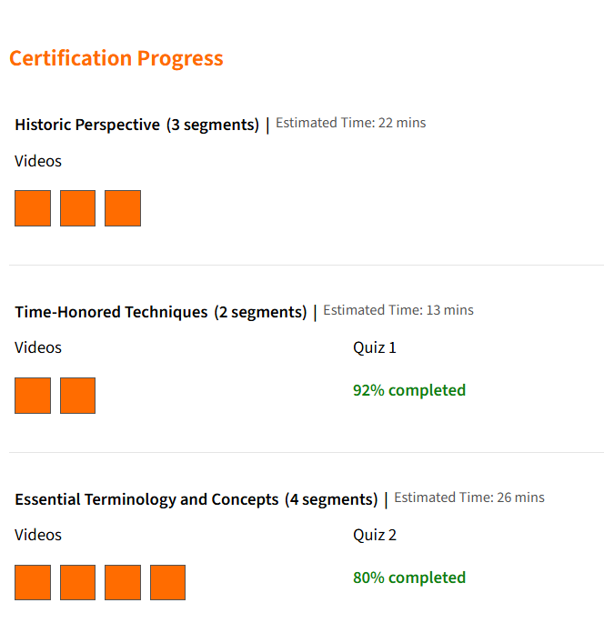
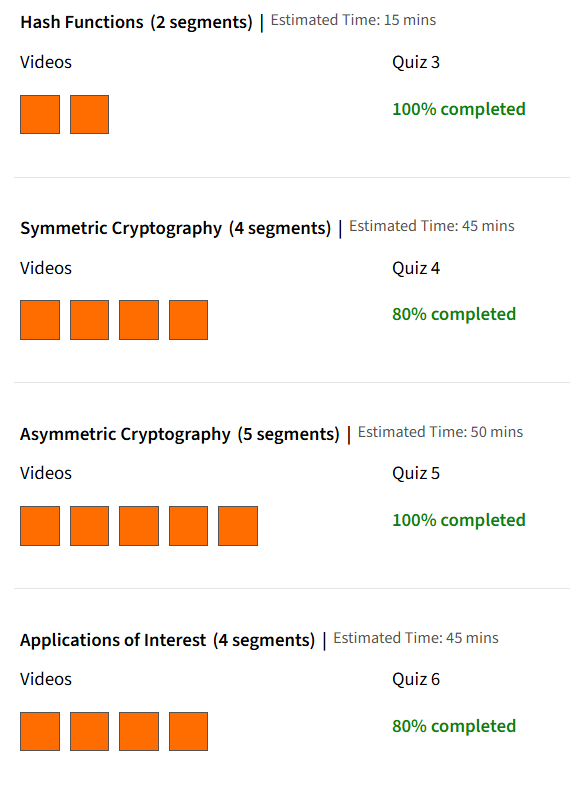

# 🔐 Introduction to Cryptography – Wolfram U  

This repository contains structured notes, labs, playbooks, extra resources, and the certificate of completion for the **“Introduction to Cryptography”** course by **Wolfram U**.  

---

## 📚 Notes  

- 📝 [`01-introduction-to-cryptography.md`](./notes/01-introduction-to-cryptography.md) – Course intro & history  
- 📝 [`02-classical-ciphers.md`](./notes/02-classical-ciphers.md) – Substitution & transposition ciphers  
- 📝 [`03-modern-block-ciphers.md`](./notes/03-modern-block-ciphers.md) – DES, AES, modes of operation  
- 📝 [`04-stream-ciphers.md`](./notes/04-stream-ciphers.md) – Stream cipher concepts  
- 📝 [`05-public-key-cryptography.md`](./notes/05-public-key-cryptography.md) – RSA & PKI  
- 📝 [`06-hash-functions.md`](./notes/06-hash-functions.md) – Cryptographic hash functions  
- 📝 [`07-digital-signatures.md`](./notes/07-digital-signatures.md) – Integrity & authentication  
- 📝 [`08-key-exchange.md`](./notes/08-key-exchange.md) – Diffie–Hellman, key agreement  
- 📝 [`09-cryptographic-protocols.md`](./notes/09-cryptographic-protocols.md) – SSL/TLS, secure channels  
- 📝 [`10-elliptic-curve-cryptography.md`](./notes/10-elliptic-curve-cryptography.md) – ECC basics  
- 📝 [`11-quantum-cryptography.md`](./notes/11-quantum-cryptography.md) – Post-quantum crypto & QKD  
- 📝 [`12-applications-and-security.md`](./notes/12-applications-and-security.md) – Real-world applications  

---

## 🧪 Labs  

- 💻 [`cipher-exercises.md`](./labs/cipher-exercises.md) – Hands-on with classical ciphers  
- 💻 [`hands-on-practice.md`](./labs/hands-on-practice.md) – Core cryptography practice tasks  
- 💻 [`key-exchange-simulations.md`](./labs/key-exchange-simulations.md) – Key exchange demonstrations  

---

## 📒 Playbooks  

- ✅ [`secure-communication.md`](./playbooks/secure-communication.md) – Secure communication practices  
- ✅ [`crypto-attacks-defense.md`](./playbooks/crypto-attacks-defense.md) – Cryptographic attacks & defenses  

---

## 🔬 Extras  

- 📄 [`case-studies.md`](./extras/case-studies.md) – Cryptography in real-world scenarios  
- 📄 [`resources.md`](./extras/resources.md) – Useful study resources  
- 📄 [`timeline.md`](./extras/timeline.md) – Cryptography evolution timeline  

---

## 📖 Documentation  

- 📘 [`index.md`](./docs/index.md) – Overview & objectives  
- 📘 [`syllabus.md`](./docs/syllabus.md) – Course syllabus  
- 📘 [`roadmap.md`](./docs/roadmap.md) – Learning roadmap  
- 📘 [`glossary.md`](./docs/glossary.md) – Key terms & definitions  
- 📘 [`references.md`](./docs/references.md) – References & sources  

---

## 📸 Screenshots  

| Section                  | Screenshot |
|---------------------------|------------|
| 📚 Course Progress 1      |  |
| 📚 Course Progress 2      |  |

---

## 📜 Certificate  

📄 [`Introduction to Cryptography – Wolfram U`](./cert/Introduction%20to%20Crypt%20Wolfarm%20U.pdf)  

---

## 🗣️ Personal Review  

The **Introduction to Cryptography** course by Wolfram U provides a solid foundation in both **classical** and **modern cryptographic systems**.  
- ✅ Well-structured with clear explanations.  
- ✅ Strong emphasis on **mathematical underpinnings** and real-world applications.  
- ✅ Covers advanced topics like **ECC** and **Quantum Cryptography**.  
- ⚠️ Requires basic math (modular arithmetic, number theory) to follow smoothly.  

👉 Overall, highly recommended for learners seeking a **comprehensive cryptography primer**.  

---

## ✍️ Author  

**Thành Danh** – Red Team Learner & Security Researcher  

- GitHub: [@ngvuthdanhh](https://github.com/ngvuthdanhh)  
- Email: ngvu.thdanh@gmail.com  

---

## 📄 License  

This project is licensed under the terms of the **MIT License**.  
See [`LICENSE`](./LICENSE) for full details.  

© 2025 ngvuthdanhh. All rights reserved.  
